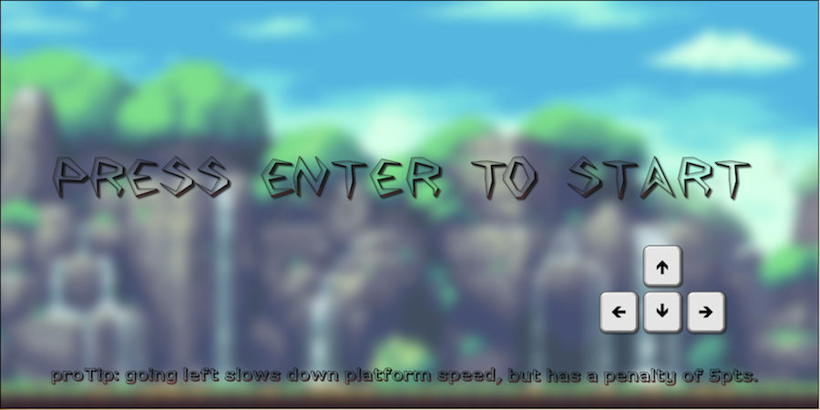
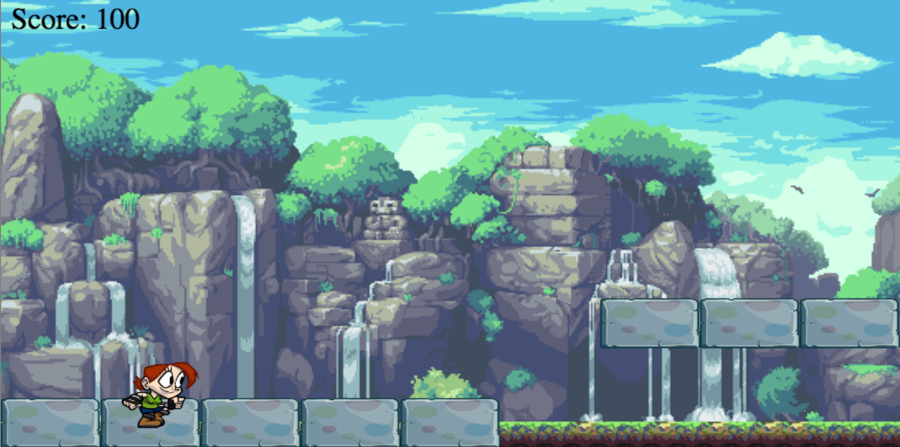

## Robi Runner

[live](http://yoseph.me/Runner)

#### About
Robi Runner is a type of platform game. The Game allows players to jump on different levels of platform to stay alive. The platform themselves start moving in the opposite direction once a Player reaches a certain score.

#### Controls
movement of a player can be controlled using the direction keys on the keyboard. The Game has optional control 'A' for left, 'D' for right and 'W' and 'spacebar' for jump.

#### Playing the Game
The landing page waits for the player input to start the game. It also displays playing keys with an associated proTip.

Once player is ready the can press the enter key to start.

The level of difficulty of the game increases as time goes by. The way I implemented this is by having the platforms move in the opposite direction and increasing their speed based on score and how long a player has played.

The way the scoring system works is as follows. Player gets 100pts for landing on a platform with different height levels. Players additionally get 5pts for moving forward and lose 5pts for moving backwards.

#### Architecture and Technologies
- Vanilla Javascript for game logic
- HTML5 Canvas for rendering and graphics
- Webpack to bundle and serve scripts

#### Future Features
- achievement checkpoints
- persisting scoreboards

[pic]: ./wireframe/wireframe.png
